# Industry Risk DB

This repository holds a **supply-chain risk analytics platform** focused on import and its implied trade exposure. It combines UN Comtrade trade data with derived risk signals so procurement, operations, and analytics teams can see which supplier countries create the most concentration, logistics, and policy risk.

**Value proposition**: Through improved understanding of interdependencies in the sourcing environment, decisions can be priced for risk at a current rate, ensuring **plannability** and **financial stability**.

The repository contains two working streams:

1. A lightweight prototype path using Azure Table Storage (or local sample data) for quick UI demos.
2. A more robust Azure SQL + dbt path that ingests raw trade data, models it into staging and mart layers, and powers the SQL-backed dashboard.

## End-To-End Dataflow

```mermaid
flowchart LR
    subgraph source["1. External Source"]
        A["UN Comtrade API"]
    end

    subgraph ingest["2. Ingestion Layer"]
        B["fetch_data_products.py<br/>Fetch + normalize trade rows"]
        C["risk_sql_pipeline.py<br/>Enrich, filter, derive risk signals"]
    end

    subgraph raw["3. Raw SQL Layer"]
        D["raw.comtrade_trade"]
        E["raw.logistics_signals"]
        F["raw.policy_signals"]
    end

    subgraph staging["4. dbt Staging Layer"]
        G["stg_comtrade_trade"]
        H["stg_logistics_signals"]
        I["stg_policy_signals"]
    end

    subgraph marts["5. dbt Mart Layer"]
        J["mart.hhi_layer"]
        K["mart.logistics_layer"]
        L["mart.policy_layer"]
        M["mart.supplier_risk"]
    end

    subgraph serve["6. Serving Layer"]
        N["risk_dashboard_sql.py<br/>SQL-backed Streamlit dashboard"]
    end

    A --> B --> C
    C --> D
    C --> E
    C --> F

    D --> G
    E --> H
    F --> I

    G --> J
    H --> K
    I --> L

    J --> M
    K --> M
    L --> M

    M --> N
    J -.detail view.-> N
    K -.detail view.-> N
    L -.detail view.-> N

    classDef sourceNode fill:#E3F2FD,stroke:#1E88E5,color:#0D47A1,stroke-width:2px;
    classDef ingestNode fill:#E8F5E9,stroke:#43A047,color:#1B5E20,stroke-width:2px;
    classDef rawNode fill:#FFF3E0,stroke:#FB8C00,color:#E65100,stroke-width:2px;
    classDef stagingNode fill:#F3E5F5,stroke:#8E24AA,color:#4A148C,stroke-width:2px;
    classDef martNode fill:#FCE4EC,stroke:#D81B60,color:#880E4F,stroke-width:2px;
    classDef serveNode fill:#E0F7FA,stroke:#00ACC1,color:#006064,stroke-width:2px;

    class A sourceNode;
    class B,C ingestNode;
    class D,E,F rawNode;
    class G,H,I stagingNode;
    class J,K,L,M martNode;
    class N serveNode;

    style source fill:#F8FBFF,stroke:#90CAF9,stroke-width:2px;
    style ingest fill:#F6FFF7,stroke:#A5D6A7,stroke-width:2px;
    style raw fill:#FFF8F1,stroke:#FFCC80,stroke-width:2px;
    style staging fill:#FBF5FF,stroke:#CE93D8,stroke-width:2px;
    style marts fill:#FFF5F8,stroke:#F48FB1,stroke-width:2px;
    style serve fill:#F2FCFD,stroke:#80DEEA,stroke-width:2px;
```



## What The System Produces

The project organizes risk into three layers:

- `HHI` (concentration risk): measures how dependent a reporter country is on a small number of suppliers for a given HS product code.
- `Logistics` risk: estimates supply-chain fragility using lead time, lead time variability, freight pressure, and disruption signals.
- `Policy` risk: estimates regulatory exposure using tariff, sanctions, export-control, and policy-volatility signals.

These are blended into a supplier-level score in the SQL mart:

- `overall_risk = 50% HHI + 30% logistics + 20% policy`

That weighting is implemented in the dbt model for `mart.supplier_risk`.

## Who This Is For

- Business stakeholders: use the dashboards to identify sourcing concentration, supplier-country exposure, and candidate diversification priorities.
- Data and analytics teams: extend the ingestion logic, refine scoring, and build downstream models from the SQL marts.
- Engineers: deploy the Azure resources, run the ingestion pipeline, and maintain the Streamlit apps and dbt project.


## Repository Structure

- `fetch_data_products.py`: calls the UN Comtrade API, loads `.env`, maps partner codes to names from `partnerAreas.json`, and returns pandas DataFrames.
- `calculate_trade_risk.py`: computes Herfindahl-Hirschman Index (HHI) style concentration metrics from trade flows.
- `risk_sql_pipeline.py`: main ingestion pipeline for the Azure SQL path. It fetches Comtrade data, derives logistics and policy risk signals, and writes raw tables.
- `sql_bootstrap.py`: applies `sql/schema.sql` to create required SQL schemas, tables, and indexes.
- `sql/schema.sql`: creates the `raw`, `staging`, and `mart` schemas plus raw ingestion tables.
- `dbt_risk/`: dbt project that transforms raw SQL data into staging views and mart tables.
- `risk_dashboard_sql.py`: Streamlit dashboard that reads from the `mart` schema in Azure SQL.
- `risk_layers_store.py`: storage abstraction for the prototype layer-based dashboard; supports Azure Table Storage or local sample rows.
- `risk_dashboard_layers.py`: Streamlit dashboard for the Table Storage / sample-data path.
- `seed_risk_layers.py`: seeds sample layer data into Azure Table Storage.
- `infra/main.bicep`: provisions Azure Storage and the three Azure Tables.
- `infra/sql.bicep`: provisions Azure SQL Server and database.
- `scripts/`: deployment and pipeline orchestration scripts.

## Business Logic In Plain English

### 1. Trade concentration

The system uses Comtrade trade values by supplier country and HS code. If one or two suppliers dominate total imports, the concentration score rises. This highlights categories where a disruption in one country would create outsized impact.

### 2. Logistics risk

The current SQL pipeline uses deterministic heuristics (`HEURISTIC_V1`) rather than live freight or transit APIs. It derives:

- `lead_time_days`
- `lead_time_stddev_days`
- `freight_index`
- `disruption_index`

These are combined into a normalized `risk_score` between `0` and `1`.

### 3. Policy risk

The current SQL pipeline also uses deterministic heuristics (`HEURISTIC_V1`) for:

- `tariff_pct`
- `sanctions_flag`
- `export_control_flag`
- `policy_volatility`

These are combined into a normalized `risk_score` between `0` and `1`.

### 4. Supplier prioritization

In the SQL mart, the three layers are merged by `reporter_code` and `supplier_country_code`. The resulting `overall_risk` score is intended for prioritization, not as a formal forecast. It is best used to rank attention, compare sourcing exposure, and trigger deeper analysis.

## Data Model

### Raw SQL tables

- `raw.comtrade_trade`: fetched trade rows, including `flow_code`, `ref_year`, `partner_code`, `cmd_code`, `trade_value_usd`, and `net_weight_kg`.
- `raw.logistics_signals`: one row per reporter/supplier pair with derived logistics attributes and `risk_score`.
- `raw.policy_signals`: one row per reporter/supplier/HS code with derived policy attributes and `risk_score`.

### dbt staging layer

The staging models cast types, standardize column names, and remove "World" aggregate rows so downstream marts operate on country-level supplier data.

### dbt mart layer

- `mart.hhi_layer`: calculates supplier trade share, HHI contribution, overall HHI index, and an HHI-based `risk_score`.
- `mart.logistics_layer`: keeps the latest logistics record per reporter and supplier, with clamped `risk_score`.
- `mart.policy_layer`: keeps the latest policy record per reporter, supplier, and HS code, with clamped `risk_score`.
- `mart.supplier_risk`: merges all three layers into one supplier-level view with the weighted `overall_risk`.

## Dashboards

### `risk_dashboard_sql.py`

This is the production-oriented dashboard:

- Connects to Azure SQL via SQLAlchemy and `pyodbc`
- Reads from `mart.supplier_risk`, `mart.hhi_layer`, `mart.logistics_layer`, and `mart.policy_layer`
- Shows KPI metrics, a top-supplier risk bar chart, a trade-share sunburst, and raw data tabs

Use this dashboard when the SQL pipeline and dbt models have been run.

### `risk_dashboard_layers.py`

This is the prototype/demo dashboard:

- Reads risk layers from Azure Table Storage if `AZURE_STORAGE_CONNECTION_STRING` is configured
- Falls back to built-in sample data if Azure is not configured
- Lets you seed sample rows for demo purposes

Use this dashboard when you want a quick demo without the SQL stack.

### `risk_observer.py`

This is the older direct-API Streamlit view. It reads Comtrade data live and calculates HHI without the SQL or Azure storage layers. It is useful for experimentation, but it is not the main persisted pipeline.

## Setup

### 1. Python dependencies

Install the app dependencies:

```bash
pip install -r requirements.txt
```

Install the SQL dependencies if you will use Azure SQL:

```bash
pip install -r requirements-sql.txt
```

Install dbt dependencies if you will run the transformation layer:

```bash
pip install -r dbt_risk/requirements-dbt.txt
```

You also need an ODBC SQL Server driver installed locally (`ODBC Driver 17` or `18`).

### 2. Environment variables

The project expects a root `.env` file. Key values used in this repository:

- `comtrade_subscription_key`
- `AZURE_STORAGE_CONNECTION_STRING`
- `AZURE_SQL_SERVER`
- `AZURE_SQL_DATABASE`
- `AZURE_SQL_USER`
- `AZURE_SQL_PASSWORD`
- `AZURE_SQL_DRIVER` (optional; auto-detected when possible)

### 3. Azure infrastructure (optional)

Provision Azure Table Storage for the prototype dashboard:

```bash
./scripts/deploy_azure_storage.sh <resource-group> <location> <storage-account-name>
```

Provision Azure SQL for the SQL pipeline:

```bash
./scripts/deploy_azure_sql.sh <resource-group> <location> <sql-server-name> <sql-db-name> <sql-admin-user> <sql-admin-password>
```

## Running The SQL Pipeline

Apply the SQL schema:

```bash
python3 sql_bootstrap.py
```

Run the ingestion pipeline for a single country (default example: Austria `040`, HS `7208`, imports and exports for `2024`):

```bash
python3 risk_sql_pipeline.py --country 040 --period 2024 --cmd-codes 7208 --flows M,X
```

Run the full helper script that applies schema, ingests one or more countries, and executes dbt:

```bash
./scripts/run_pipeline_and_dbt.sh 040 2024 7208 M,X
```

You can pass multiple country codes as a comma-separated first argument, for example `040,276`.

## Running dbt

From the helper script, dbt runs automatically using `dbt_risk/profiles/profiles.yml`.

If you want to run it manually:

```bash
cd dbt_risk
dbt run --profiles-dir profiles
dbt test --profiles-dir profiles
```

## Running The Dashboards

Run the SQL-backed dashboard:

```bash
streamlit run risk_dashboard_sql.py
```

Run the prototype layer dashboard:

```bash
streamlit run risk_dashboard_layers.py
```

Run the direct API dashboard:

```bash
streamlit run risk_observer.py
```

## Important Design Notes

- The logistics and policy signals in the SQL path are heuristic placeholders, not externally validated operational feeds.
- The HHI layer is most meaningful for import exposure; `mart.supplier_risk` explicitly uses import rows (`flow_code = 'M'`) for HHI aggregation.
- The system removes `World` aggregate rows so concentration logic is based on actual partner countries.
- The SQL path is append-based in raw tables and "latest record" based in the dbt marts.
- Country codes are normalized to zero-padded forms like `040`, but some read paths also tolerate compact forms like `40`.

## Suggested Next Improvements

- Replace heuristic logistics and policy scoring with external operational data sources.
- Add dbt source tests and model tests beyond the current basic run/test flow.
- Add orchestration (for example, scheduled ingestion by country and HS category).
- Version the risk methodology so business users can see when scoring logic changes.
- Add alerting thresholds for rapid increases in supplier risk.

## Quick Summary

If you are a business user, think of this repo as a supplier-risk observatory for international sourcing.

If you are a developer, think of it as:

- an ingestion layer (`fetch_data_products.py`, `risk_sql_pipeline.py`)
- a transformation layer (`dbt_risk`)
- a serving layer (`risk_dashboard_sql.py`)
- and a simpler prototype path (`risk_layers_store.py`, `risk_dashboard_layers.py`)

That split is the key to understanding how the project is organized.
